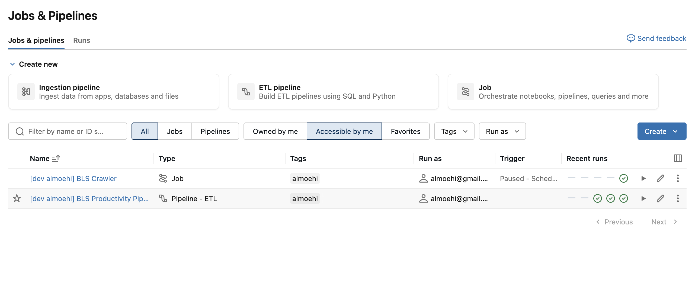
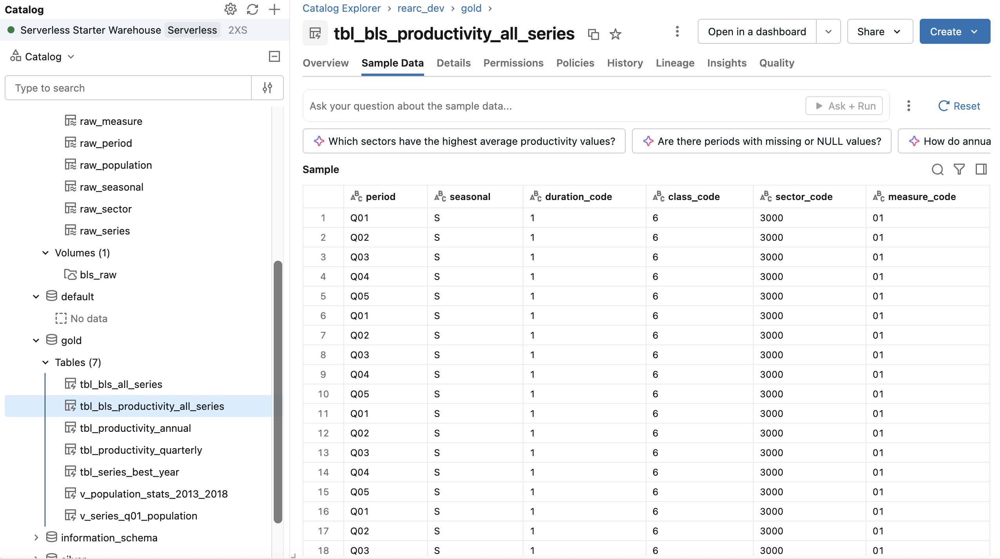
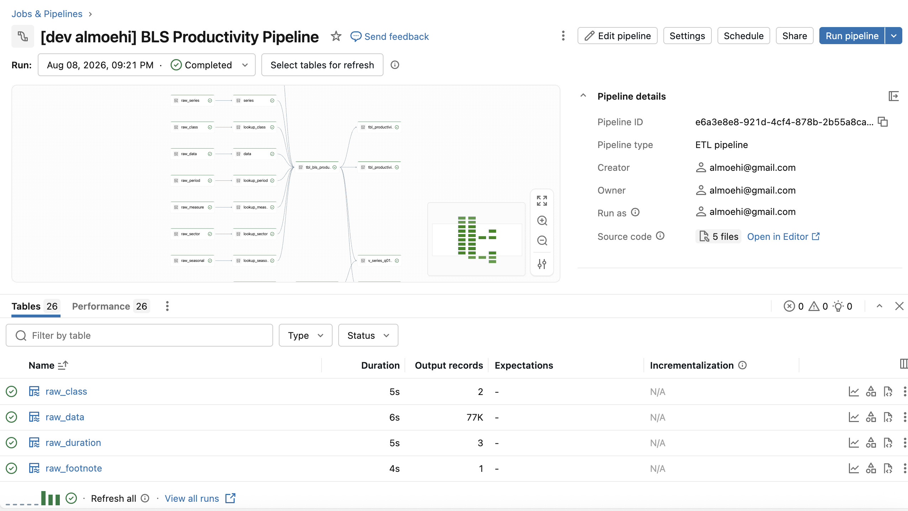
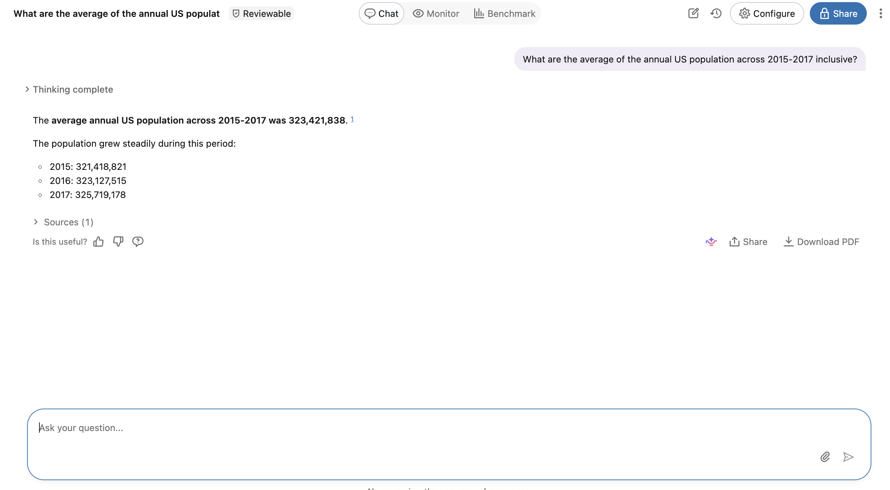

# README
To run this e2e:
- must have a `rearc_dev` catalog in your workspace
- must have databricks cli configured with `dev` profile
```bash
./setup.sh    # bootstrap workspace
./run.sh      # run full pipeline via DAB
./teardown.sh # cleanup after you
```

# Screenshots



